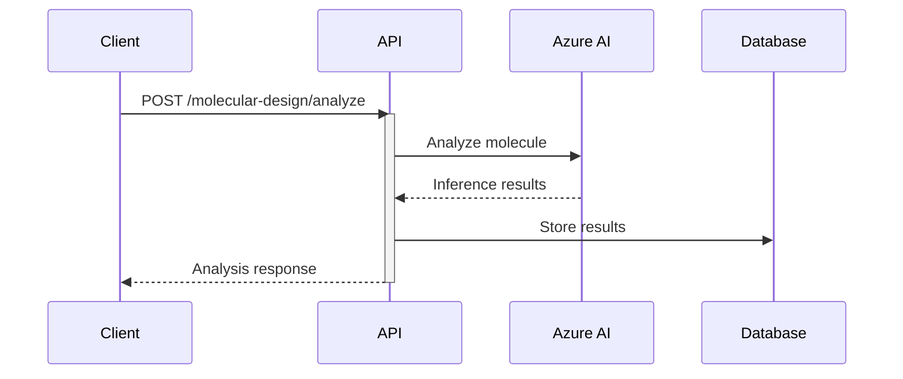

# Drug Development Platform Backend 🧬

## OpenTelemetry Integration 📊

This project uses OpenTelemetry for distributed tracing to monitor and debug the drug development pipeline. Traces help us understand:

- 🔍 Performance bottlenecks
- 🔗 Request flows through the system
- ❌ Error patterns and their context
- 📈 AI model inference timing

### Viewing Traces

1. Traces are collected by the OpenTelemetry collector at:
   ```
   http://localhost:4318/v1/traces
   ```

2. Key spans to monitor:
   - `molecular_design.analyze`: Molecule analysis and AI inference
   - `clinical_trials.monitor`: Trial monitoring and metrics
   - `clinical_trials.predict_response`: Patient response predictions

3. Important attributes in traces:
   - `molecule.id`: Unique identifier for drug candidates
   - `molecule.type`: Type of molecule being analyzed
   - `therapeutic.area`: Target therapeutic area
   - `analysis.efficacy`: Predicted efficacy score
   - `analysis.safety`: Safety assessment score
   - `trial.id`: Clinical trial identifier
   - `patient.id`: Patient identifier for specific analyses

### Example Trace Analysis



The trace will show timing for each step and include relevant attributes for debugging and monitoring.
